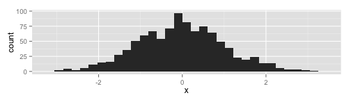

## Read-And-Delete

1. Edit YAML front matter
2. Write using R Markdown
3. Use an empty line followed by three dashes to separate slides!

--- .class #id 

## Histogram of Normal Random Variable

Create a plot in ggplot2:

```r
require(ggplot2)
x = rnorm(1000)
qplot(x)
```

```
## stat_bin: binwidth defaulted to range/30. Use 'binwidth = x' to adjust this.
```

 


---

## Unordered Lists

* Main point 1
* Main point 2
  + Sub point 2a
  + Sub point 2b
  
One sample $t$ confidence interval for mean:
$$
\bar X \pm t^* \frac{s}{\sqrt{n}}
$$
  

---

## Include a Local images

Here is my picture on a slide:


 Here's another picture:


